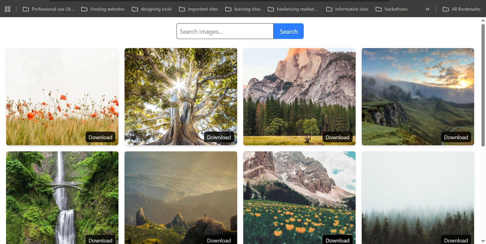

# Image-Gallery

A simple, modern, and responsive image gallery built with React and Vite. Easily upload, preview, download, and manage your images in a beautiful grid layout.



## Features

- **Upload & Display**: Add images from your device and view them instantly in the gallery.
- **Responsive Grid**: The gallery adapts to all screen sizes for a seamless experience.
- **Image Preview**: Click any image to view it in a larger modal.
- **Delete & Download**: Remove unwanted images or download your favorites with a single click.


## Getting Started

Follow these steps to set up and run the project locally:

1. **Clone the repository:**
    ```bash
    git clone https://github.com/hamzakhan-std25/Image-Gallery.git
    ```
2. **Install dependencies:**
    ```bash
    npm install
    ```
3. **Start the development server:**
    ```bash
    npm run dev
    ```

The app will be available at `http://localhost:5173` (or as indicated in your terminal).


## Folder Structure

```
src/
    components/   # React components (e.g., Home, Gallery, etc.)
    assets/       # Static assets (images, icons, etc.)
    App.jsx       # Main app component
    main.jsx      # Entry point
```


## Contributing

Contributions are welcome! Please open an issue or submit a pull request for any improvements or bug fixes.

## License

This project is licensed under the MIT License.

## Contact

For questions or feedback, please contact [hamzakhan-std25](https://github.com/hamzakhan-std25).